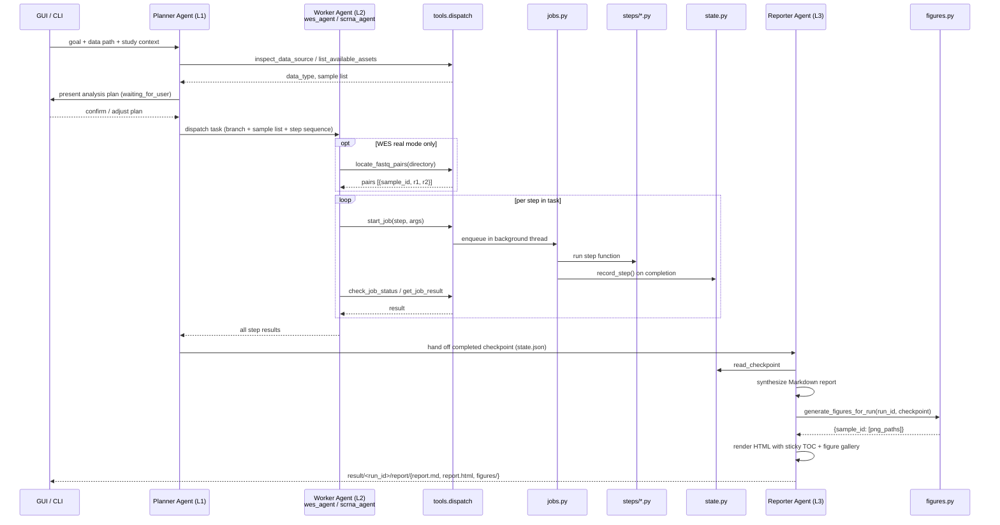
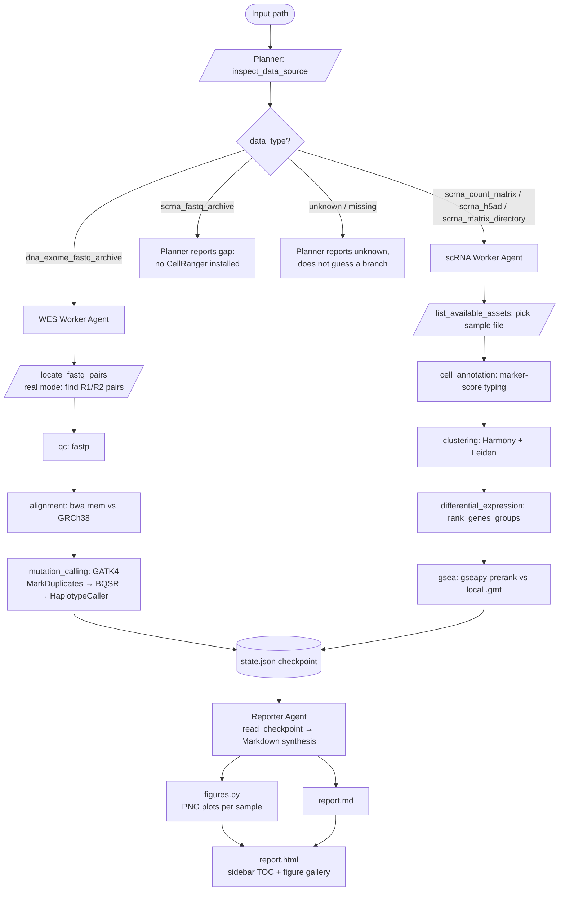

# LLM-orchestrated bioinformatics pipeline agent

An LLM drives a multi-step bioinformatics pipeline, automatically detecting
whether input data is whole-exome sequencing (WES) or single-cell RNA-seq
(scRNA) and routing to the appropriate analysis branch. Drive it from a
browser chat UI (`server.py`) or from the CLI (`test_dispatch.py`,
`run_pipeline.py`). Supports Claude (Anthropic), Google Gemini, xAI Grok,
and any OpenAI-compatible endpoint (OpenAI, Ollama, vLLM, Groq, etc.).

## Quick start (first-time user)

```bash
# 1. Install dependencies
pip install -r requirements.txt

# 2. Download a free public demo dataset (~7 MB, no account needed)
python download_demo_data.py
# → saves data/demo/pbmc3k.h5ad  (PBMC 3k, 2,700 cells × 32,738 genes)

# 3. Start the web GUI
python server.py
# → open http://127.0.0.1:8000
```

In the browser:
1. **Provider** — pick Claude, Gemini, or Grok (or OpenAI-compatible for others)
2. **API key** — paste your key (see where to get one below)
3. **Data path** — click **"Use demo data"** (or type `data/demo/pbmc3k.h5ad`)
4. Click **Start run**

The agent inspects the data, picks the scRNA branch, runs all four steps
(cell annotation → clustering → differential expression → GSEA), generates
figures, and writes an HTML report. When done, a green **"Open report"**
button appears in the sidebar.

### API keys

| Provider | Where to get a key |
|---|---|
| Claude (Anthropic) | console.anthropic.com → API Keys |
| Google Gemini | aistudio.google.com/apikey |
| xAI Grok | console.x.ai |
| OpenAI | platform.openai.com/api-keys |

Keys are sent from the browser to this local server process only, forwarded
directly to the chosen SDK, and never logged or written to disk.

---

## Why two branches, and why names aren't trusted

`data/WES_OC_fasta` (originally named `data/OC_scRNA_fasta` — renamed once
the mismatch was found) is a symlink to whole-exome sequencing (WES) fastq
archives, not scRNA-seq data, despite its original name — confirmed by
reading the manifest files and peeking read lengths inside the zips (see
`src/agent_pipeline/steps/detect.py`). The real scRNA-seq data for the OC
cohort exists only as already-processed CellRanger `.h5` matrices and
`.h5ad` AnnData objects under `StrasbourgOC/data/scRNA/` and
`StrasbourgOC/data/*.h5ad` — there is no raw scRNA fastq for OC on disk.

`data/scRNA_AML` is a symlink to `StrasbourgAML/data/raw`: a directory of 36
already-processed CellRanger `.h5` matrices (one per AML patient/sample) —
this one's name matches its content, and `inspect_data_source` confirms it
(`scrna_matrix_directory`, verified against a representative file: 36,601
genes × 2,448 cells). Used as the deliberate "opposite case" test of the
adaptive routing logic.

So the agent's job is to detect each input's real type and route accordingly:

- **WES branch** (`dna_exome_fastq_archive`): QC (fastp) → alignment (bwa
  mem) → mutation calling (GATK4: MarkDuplicates → BQSR → HaplotypeCaller)
- **scRNA branch** (`scrna_count_matrix` / `scrna_h5ad` / `scrna_matrix_directory`):
  cell-type annotation (marker scoring) → clustering (Harmony + Leiden) →
  differential expression (`rank_genes_groups`) → GSEA (`gseapy.prerank`
  against local MSigDB/KEGG/GO/Reactome `.gmt` files at
  `data/RefGenome/*.gmt`)

## Architecture

The system is organized into four layers. Each layer is a distinct LLM agent
(or the human-facing GUI); agents at a higher layer do not directly call step
functions — they delegate down.

### Layer overview

```
┌──────────────────────────────────────────────────────────────────┐
│  Layer 0 — GUI                                                   │
│  server.py  +  static/index.html                                 │
│  User provides: data path · study design · sample metadata ·     │
│  LLM provider + API key · free-text instructions / corrections   │
└─────────────────────────┬────────────────────────────────────────┘
                          │ goal + context
                          ▼
┌──────────────────────────────────────────────────────────────────┐
│  Layer 1 — Planner Agent   agents/planner.py                     │
│  • Inspects data (inspect_data_source / list_available_assets)   │
│  • Builds and presents an analysis plan                          │
│  • Dispatches tasks to one or more worker agents (Layer 2)       │
│  • Monitors worker progress; re-plans on failure or user change  │
│  • Hands the completed checkpoint to the Reporter (Layer 3)      │
└──────────┬───────────────────────────────┬───────────────────────┘
           │ WES task                      │ scRNA task
           ▼                               ▼
┌──────────────────────┐       ┌───────────────────────────────────┐
│  Layer 2 —           │       │  Layer 2 —                        │
│  WES Worker Agent    │       │  scRNA Worker Agent               │
│  agents/wes_agent.py │       │  agents/scrna_agent.py            │
│                      │       │                                   │
│  QC (fastp)          │       │  Cell annotation (marker scoring) │
│  Alignment (bwa mem) │       │  Clustering (Harmony + Leiden)    │
│  Mutation calling    │       │  Diff. expression (rank_genes)    │
│  (GATK4)             │       │  GSEA (gseapy prerank)            │
└──────────┬───────────┘       └──────────────────┬────────────────┘
           │  step results                        │
           └──────────────────┬───────────────────┘
                              │ full checkpoint
                              ▼
┌──────────────────────────────────────────────────────────────────┐
│  Layer 3 — Reporter Agent   agents/reporter.py                   │
│  • Reads state.json; synthesizes findings across steps/samples   │
│  • Writes narrative report (Markdown + HTML)                     │
│  • Generates figures (scanpy plots, mutation summary tables)     │
│  • Output: result/<run_id>/report/                               │
└──────────────────────────────────────────────────────────────────┘
```

### File layout

```
requirements.txt         pip dependencies (anthropic, openai, matplotlib, scanpy, anndata, h5py)
download_demo_data.py    downloads the public PBMC 3k scRNA-seq dataset for demo/testing
run_pipeline.py          CLI entrypoint: goal → planner agent, runs to completion
server.py                web server: GUI ↔ planner agent session
static/index.html        browser GUI (provider picker, API key, data path, chat panel)
test_dispatch.py         no-LLM step-library test harness; optionally calls Reporter with --api-key
src/agent_pipeline/
  agents/
    planner.py           Layer 1: data understanding, plan creation, worker dispatch
    wes_agent.py         Layer 2: WES pipeline execution agent
    scrna_agent.py       Layer 2: scRNA pipeline execution agent
    reporter.py          Layer 3: result synthesis, report & figure generation
  prompts/
    planner.py           system prompt for the planner (branch logic, tool catalog)
    wes.py               system prompt for the WES worker
    scrna.py             system prompt for the scRNA worker
    reporter.py          system prompt for the reporter
  figures.py             matplotlib figure generation from checkpoint data (no display
                         required); 6 plot types per branch: cell-type composition, mock
                         UMAP, cluster sizes, DE genes, GSEA, WES variant summary
  providers.py           LLM provider abstraction: AnthropicProvider, OpenAIProvider,
                         make_provider(); Gemini and Grok route through OpenAIProvider
                         with fixed base URLs; per-agent tool list injected at construction
  tools.py               8 tool schemas + dispatch table → steps/*; per-agent subsets:
                         PLANNER_TOOLS, WORKER_TOOLS, REPORTER_TOOLS
  jobs.py                background job queue (start/poll/result)
  state.py               checkpoint persistence: result/<run_id>/state.json + agent_log.jsonl;
                         report_dir() helper for result/<run_id>/report/
  steps/
    detect.py            classifies a path without extracting any archive
    qc.py                fastp (WES)
    alignment.py         bwa mem → sorted+indexed BAM (WES)
    mutation.py          GATK4 germline calling (WES)
    annotation.py        marker-score cell typing (scRNA)
    clustering.py        Harmony + Leiden (scRNA)
    diffexp.py           rank_genes_groups (scRNA)
    gsea.py              gseapy prerank (scRNA)
```

Every step module has a `mode="mock"` path (fast, synthetic-but-plausible
metrics seeded deterministically from the real input's path/size — so
repeated mock runs on the same input agree) and a `mode="real"` path that
shells out to / calls the actual tool. **This repo's demo runs only exercise
mock mode** — real mode is fully wired (reference genome, dbSNP known-sites,
and gene-set files are all already present under `data/RefGenome/`) but
deliberately not executed here, since a real run touches ~1TB of compressed
data and can take hours.

All heavy steps go through `start_job` / `check_job_status` / `get_job_result`
(`jobs.py`) uniformly — even in mock mode — so the tool-calling contract
worker agents learn doesn't change when real mode is switched on later.
Checkpointing to `result/<run_id>/state.json` happens automatically when a
job completes, not left to any agent to remember.

### Diagram 1: multi-agent flow



The web GUI runs the planner agent inside a background thread (via `session.py`)
that pauses at `waiting_for_user` to receive user corrections or follow-up
questions, then resumes. The CLI runs the same planner-to-worker-to-reporter
chain to completion without pausing.

### Diagram 2: data-driven branching and reporting



## Requirements

### Python packages

```bash
pip install -r requirements.txt
```

| Package | Needed for |
|---|---|
| `anthropic>=0.111` | Claude provider (Planner, Worker, Reporter agents) |
| `openai>=1.0` | Gemini, Grok, and OpenAI-compatible providers (all route through `OpenAIProvider`) |
| `matplotlib>=3.7` | `figures.py` — PNG plots for the HTML report (Agg backend, no display needed) |
| `scanpy>=1.9` | scRNA steps (mock mode: header peeking; real mode: clustering, DE, GSEA) |
| `anndata>=0.9` | scRNA `.h5ad` file I/O |
| `h5py>=3.8` | CellRanger `.h5` matrix reading and demo data download |

Both `anthropic` and `openai` are always required — `openai` is used for
Gemini and Grok even though they are not OpenAI products, because both
vendors expose an OpenAI-compatible REST endpoint.

**Real-mode only** (not in `requirements.txt` — installed separately):

| What | Needed for | Where |
|---|---|---|
| `harmonypy`, `leidenalg`, `gseapy` | scRNA real-mode steps | base conda env |
| `bwa`, `gatk4`, `picard`, `samtools`, `bcftools`, `fastp` | WES real-mode steps | conda env `wes` |
| `unzip`, `gunzip` | `detect.py` peeking inside fastq zip archives | system tools |

Mock mode (the default) only needs the packages in `requirements.txt`.

### LLM providers

| Provider | API key source | Default model |
|---|---|---|
| Claude (Anthropic) | console.anthropic.com | `claude-opus-4-8` |
| Google Gemini | aistudio.google.com/apikey | `gemini-2.5-flash` |
| xAI Grok | console.x.ai | `grok-3` |
| OpenAI | platform.openai.com/api-keys | `gpt-4o` |
| OpenAI-compatible (Ollama, vLLM, Groq, ...) | varies | set `--model` explicitly |

The Model field in the GUI can be left blank to use the provider's default.

### Data

| Path | What it is | Required for |
|---|---|---|
| `data/demo/pbmc3k.h5ad` | PBMC 3k scRNA-seq dataset; run `download_demo_data.py` | demo / first-time use |
| `data/WES_OC_fasta` | symlink → exome fastq archives (StrasbourgOC, ~1TB zipped) | WES branch example |
| `data/scRNA_AML` | symlink → 36 CellRanger `.h5` matrices (StrasbourgAML) | scRNA branch example |
| `data/RefGenome` | symlink → `/mnt/Storage5/RefGenome` | real-mode only |
| `data/RefGenome/GRCh38/...fa` + BWA index | bwa-indexed GRCh38 reference | real-mode `alignment.py` |
| `data/RefGenome/dbSNP_GCF_000001405.40.gz(.tbi)` | known-sites VCF for BQSR | real-mode `mutation.py` |
| `data/RefGenome/*.gmt` | MSigDB / KEGG / GO / Reactome gene sets | real-mode `gsea.py` |

To point the framework at a new dataset, pass any absolute path or a
repo-relative path to `--data` / `inspect_data_source`. `detect.py`
classifies by file content, not by name.

Supported input shapes: a directory of fastq-in-zip archives with manifests
(→ `dna_exome_fastq_archive` or `scrna_fastq_archive`), a single `.h5`
(→ `scrna_count_matrix`), a single `.h5ad` (→ `scrna_h5ad`), or a directory
of multiple `.h5`/`.h5ad` files (→ `scrna_matrix_directory`). Anything else
returns `unknown*` rather than a guess.

## Running it

### Web GUI (recommended)

```bash
python server.py               # http://127.0.0.1:8000
python server.py --port 8080   # custom port
```

Fill in the sidebar form and click **Start run**. The chat panel streams
every agent event in real time — thinking, tool calls, tool results — with
colour-coded badges for each sub-agent (WES Worker, scRNA Worker, Reporter).
Anything typed in the chat box mid-run is appended as the next user turn; the
agent re-reasons and continues.

Each run writes to `result/<run_id>/` on disk. If `server.py` is restarted,
re-enter the same run ID with the data path blank — the server detects the
existing checkpoint and sends a resume-context message instead of starting
fresh.

### CLI — step library test (no API key needed)

`test_dispatch.py` drives the same dispatch / job-queue / checkpoint layer
with deterministic Python branch logic instead of an LLM, then optionally
hands off to the Reporter Agent if an API key is available.

```bash
# Pipeline steps only (no key needed):
python test_dispatch.py --data data/demo/pbmc3k.h5ad --run-id demo

# Pipeline steps + Reporter in one shot:
python test_dispatch.py --data data/demo/pbmc3k.h5ad --run-id demo \
  --api-key sk-ant-...

# Other dataset examples:
python test_dispatch.py --data data/scRNA_AML --run-id aml1          # 1 sample
python test_dispatch.py --data data/scRNA_AML --all --limit 5 --run-id aml5
python test_dispatch.py --data data/WES_OC_fasta --run-id wes1
```

Reporter flags: `--api-key`, `--provider` (`anthropic`/`openai`/`gemini`/`grok`),
`--model`, `--no-report`.

### CLI — full LLM pipeline

`run_pipeline.py` lets the LLM itself inspect the data and decide the branch:

```bash
export ANTHROPIC_API_KEY=sk-ant-...
python run_pipeline.py --data data/demo/pbmc3k.h5ad --run-id demo
python run_pipeline.py --data data/WES_OC_fasta --run-id wes1
```

Flags: `--goal`, `--effort` (`low`/`medium`/`high`/`xhigh`/`max`, default `high`),
`--max-iterations` (default 40).

### Outputs

All runs write to `result/<run_id>/`:

```
state.json                     ordered checkpoint (status, inputs, outputs per step)
agent_log.jsonl                full turn-by-turn transcript for audit/debugging
report/report.md               narrative Markdown report (Executive Summary, metrics, Next Steps)
report/report.html             HTML with sticky sidebar TOC + figures gallery
report/figures/<id>_*.png      matplotlib PNGs (one set per sample, both branches)
```

## Switching a step to real mode

Pass `"mode": "real"` in the step's `args` when calling `start_job` (or tell
the agent in `--goal` to use real mode). Real mode raises a clear error
naming exactly what's missing rather than silently faking success.

**WES real-mode call sequence** (manual archive extraction required first —
this framework never auto-extracts a multi-hundred-GB archive):

1. Extract the fastq.gz files from the source zip archive manually.
2. Call `locate_fastq_pairs(directory=<extracted_dir>)` to get R1/R2 path
   pairs. Recognises four common naming conventions (`SAMPLE_R1_001`,
   `SAMPLE_R1`, `SAMPLE.R1`, `SAMPLE_1`).
3. `start_job("qc", {"sample_id": ..., "r1": ..., "r2": ..., "mode": "real"})` —
   runs fastp; trimmed outputs go to `result/qc/`.
4. `start_job("alignment", {"sample_id": ..., "r1": <trimmed_R1>, "r2": <trimmed_R2>, "mode": "real"})` —
   runs bwa mem + samtools sort/index; produces a sorted BAM.
5. `start_job("mutation_calling", {"sample_id": ..., "bam_path": <bam>, "mode": "real"})` —
   runs GATK4 MarkDuplicates → BQSR → HaplotypeCaller.

**scRNA real mode** needs no extra wiring — `input_path` is a `.h5` or `.h5ad`
file already on disk; the base conda env (scanpy, anndata, harmonypy,
leidenalg, gseapy) handles the rest.

Conda envs used in real mode: `wes` (bwa, gatk4, picard, samtools, bcftools,
fastp) for the WES branch; the base env for the scRNA branch.
