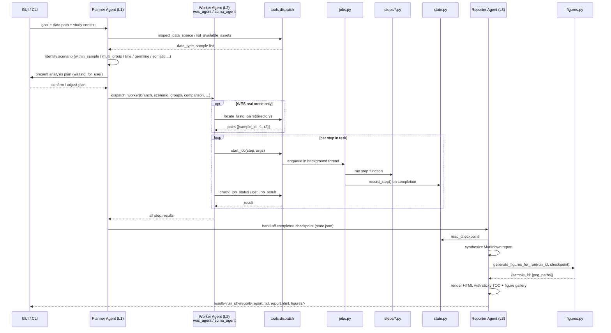
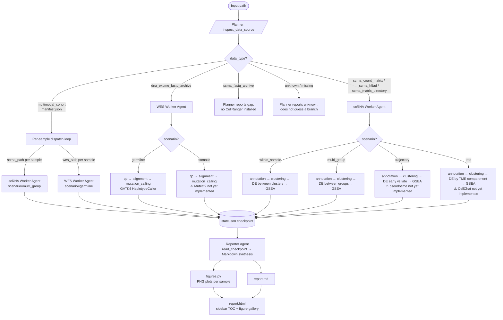

# LLM-orchestrated bioinformatics pipeline agent

An LLM drives a multi-step bioinformatics pipeline, automatically detecting
whether input data is whole-exome sequencing (WES) or single-cell RNA-seq
(scRNA) and routing to the appropriate analysis branch. Drive it from a
browser chat UI (`server.py`) or from the CLI (`test_dispatch.py`,
`run_pipeline.py`). Supports Claude (Anthropic), Google Gemini, xAI Grok,
and any OpenAI-compatible endpoint (OpenAI, Ollama, vLLM, Groq, etc.).

## Quick start (first-time user)

```bash
# 1. Install dependencies
pip install -r requirements.txt
pip install pertpy          # needed for the multimodal demo

# 2. Download the case-control multimodal demo (~100 MB, no account needed)
python download_demo_data.py
# → saves data/demo_multimodal/
#     manifest.json          study design + sample list
#     scRNA/case_donor1.h5ad   IFN-β stimulated (case, 1166 cells)
#     scRNA/case_donor2.h5ad   IFN-β stimulated (case, 2352 cells)
#     scRNA/ctrl_donor1.h5ad   unstimulated (control, 858 cells)
#     scRNA/ctrl_donor2.h5ad   unstimulated (control, 2738 cells)
#     WES/case_donor*/         mock WES stubs (GATK pipeline, no FASTQ needed)
#
# Dataset: Kang et al. 2018, Nature Biotechnology — GSE96583
# Design:  IFN-β stimulated (case) vs. unstimulated (control) PBMCs,
#          2 donors per group, 8 cell types annotated
```

### Option A — Web GUI

```bash
python server.py    # open http://127.0.0.1:8000
```

1. **Provider** — pick Claude, Gemini, or Grok (or OpenAI-compatible for others)
2. **API key** — paste your key (see [API keys](#api-keys) below)
3. **Data path** — type `data/demo_multimodal`
4. **Study design** — optionally add: `"Case-control: IFN-β stimulated vs unstimulated PBMCs"`
5. Click **Start run**

The agent detects the `manifest.json`, identifies the case-control multi-modal
scenario, dispatches scRNA workers (cell annotation → clustering → DE between
groups → GSEA) and WES workers (GATK germline, mock mode) for all four samples,
then synthesizes an integrated HTML report. A green **"Open report"** button
appears in the sidebar when done.

### Option B — CLI (no browser needed)

```bash
# Set your API key once (or pass --api-key on every command)
export ANTHROPIC_API_KEY=sk-ant-...   # Claude
# export GEMINI_API_KEY=AIza...       # Gemini
# export OPENAI_API_KEY=sk-...        # OpenAI / OpenAI-compatible

# Run the full LLM pipeline on the multimodal demo
python run_pipeline.py \
  --data data/demo_multimodal \
  --run-id kang-demo \
  --goal "Case-control: IFN-β stimulated (case) vs unstimulated (control) PBMCs, 2 donors per group"

# When done, open the report
open result/kang-demo/report/report.html          # macOS
xdg-open result/kang-demo/report/report.html      # Linux
# or just navigate to result/kang-demo/report/ in your file browser
```

**The CLI is fully interactive.** The agent pauses at each decision point and
waits for your reply at a `You:` prompt. You can:

- **Correct the scenario** — e.g. `"This is somatic, not germline — the normal sample is OC_normal"`
- **Add sample metadata** — e.g. `"Donors 1 and 2 are BRCA1-mutant, donors 3 and 4 are wild-type"`
- **Adjust the plan** — e.g. `"Skip GSEA, focus only on DE between tumor and normal"`
- **Accept and proceed** — just press **Enter** (empty reply)
- **Stop early** — press **Ctrl-C**

A typical session looks like:

```
────────────────────────────────────────────────────────────────
[planner:tool_use] inspect_data_source({"path": "data/demo_multimodal"})
[planner:tool_result] {"data_type": "multimodal_cohort", ...}

## Analysis Plan

### Data
- Type: multimodal_cohort
- Samples: case_donor1 (1166 cells), case_donor2 (2352 cells), ...
...

Shall I proceed, or would you like to adjust any part of the plan?
────────────────────────────────────────────────────────────────
You: Add a note that donors 1-2 are BRCA1-mutant — include that in the comparison
────────────────────────────────────────────────────────────────
[planner updates comparison field and re-presents plan]
...
You:                    ← press Enter to accept and start dispatch
```

The full transcript (every turn, tool call, and result) is saved to
`result/<run_id>/agent_log.jsonl` regardless of how you interact.

**Single-sample scRNA demo** (no pertpy needed, ~7 MB):

```bash
python download_demo_data.py --demo scrna
# → data/demo/pbmc3k.h5ad  (PBMC 3k, 2,700 cells × 32,738 genes)

python run_pipeline.py --data data/demo/pbmc3k.h5ad --run-id pbmc-demo
```

### API keys

| Provider | Where to get a key |
|---|---|
| Claude (Anthropic) | console.anthropic.com → API Keys |
| Google Gemini | aistudio.google.com/apikey |
| xAI Grok | console.x.ai |
| OpenAI | platform.openai.com/api-keys |

Keys are sent from the browser to this local server process only, forwarded
directly to the chosen SDK, and never logged or written to disk.

---

## Architecture

The system is organized into four layers. Each layer is a distinct LLM agent
(or the human-facing GUI); agents at a higher layer do not directly call step
functions — they delegate down.

### Layer overview

```
┌──────────────────────────────────────────────────────────────────┐
│  Layer 0 — GUI                                                   │
│  server.py  +  static/index.html                                 │
│  User provides: data path · study design · sample metadata ·     │
│  LLM provider + API key · free-text instructions / corrections   │
└─────────────────────────┬────────────────────────────────────────┘
                          │ goal + context
                          ▼
┌──────────────────────────────────────────────────────────────────┐
│  Layer 1 — Planner Agent   agents/planner.py                     │
│  • Inspects data (inspect_data_source / list_available_assets)   │
│  • Identifies analysis scenario from data type + user goal       │
│  • Builds and presents an analysis plan                          │
│  • Dispatches tasks to one or more worker agents (Layer 2)       │
│  • Hands the completed checkpoint to the Reporter (Layer 3)      │
└──────────┬───────────────────────────────┬───────────────────────┘
           │ WES task                      │ scRNA task
           ▼                               ▼
┌──────────────────────┐       ┌───────────────────────────────────┐
│  Layer 2 —           │       │  Layer 2 —                        │
│  WES Worker Agent    │       │  scRNA Worker Agent               │
│  agents/wes_agent.py │       │  agents/scrna_agent.py            │
│                      │       │                                   │
│  QC (fastp)          │       │  Cell annotation (marker scoring) │
│  Alignment (bwa mem) │       │  Clustering (Harmony + Leiden)    │
│  Mutation calling    │       │  Diff. expression (rank_genes)    │
│  (GATK4)             │       │  GSEA (gseapy prerank)            │
└──────────┬───────────┘       └──────────────────┬────────────────┘
           │  step results                        │
           └──────────────────┬───────────────────┘
                              │ full checkpoint
                              ▼
┌──────────────────────────────────────────────────────────────────┐
│  Layer 3 — Reporter Agent   agents/reporter.py                   │
│  • Reads state.json; synthesizes findings across steps/samples   │
│  • Writes narrative report (Markdown + HTML)                     │
│  • Generates figures (scanpy plots, mutation summary tables)     │
│  • Output: result/<run_id>/report/                               │
└──────────────────────────────────────────────────────────────────┘
```

### Supported analysis scenarios

The Planner detects the scenario from the data type and your stated goal,
then sets the appropriate analysis parameters for each worker.

| Scenario | Data | Goal |
|---|---|---|
| `within_sample` | scRNA, single group | Characterise cell types and cluster markers |
| `multi_group` | scRNA, 2+ groups | DE between case/control or treatment groups |
| `trajectory` | scRNA, time-series or differentiation | Pseudotime / disease progression |
| `tme` | scRNA, mixed tumour+immune | Immune infiltration, exhaustion, TME composition |
| `germline` | WES, single sample | Germline variant discovery |
| `somatic` | WES, tumour + matched normal | Somatic mutation calling (paired) |
| `multimodal` | WES + scRNA, ad-hoc paths | Integrate mutation landscape with cell-state findings |
| `multimodal_cohort` | Directory with `manifest.json` | Full case-control cohort: per-sample scRNA + WES dispatched from a single path |

### File layout

```
requirements.txt         pip dependencies (anthropic, openai, matplotlib, scanpy, anndata, h5py)
download_demo_data.py    downloads demo datasets: Kang 2018 multimodal (default) or PBMC 3k scRNA
run_pipeline.py          CLI entrypoint: goal → planner agent, runs to completion
server.py                web server: GUI ↔ planner agent session
static/index.html        browser GUI (provider picker, API key, data path, chat panel)
test_dispatch.py         no-LLM step-library test harness; optionally calls Reporter with --api-key
src/agent_pipeline/
  agents/
    planner.py           Layer 1: scenario detection, plan creation, worker dispatch
    wes_agent.py         Layer 2: WES pipeline execution agent
    scrna_agent.py       Layer 2: scRNA pipeline execution agent
    reporter.py          Layer 3: result synthesis, report & figure generation
  prompts/
    planner.py           system prompt for the planner (scenario routing, dispatch patterns)
    wes.py               system prompt for the WES worker (germline / somatic / multimodal)
    scrna.py             system prompt for the scRNA worker (within_sample / multi_group / trajectory / tme)
    reporter.py          system prompt for the reporter
  figures.py             matplotlib figure generation from checkpoint data (no display
                         required); 6 plot types per branch: cell-type composition, mock
                         UMAP, cluster sizes, DE genes, GSEA, WES variant summary
  providers.py           LLM provider abstraction: AnthropicProvider, OpenAIProvider,
                         make_provider(); Gemini and Grok route through OpenAIProvider
                         with fixed base URLs; model fallback on 503/429/529
  tools.py               tool schemas + dispatch table → steps/*; per-agent subsets:
                         PLANNER_TOOLS, WORKER_TOOLS, REPORTER_TOOLS
  jobs.py                background job queue (start/poll/result)
  state.py               checkpoint persistence: result/<run_id>/state.json + agent_log.jsonl;
                         report_dir() helper for result/<run_id>/report/
  steps/
    detect.py            classifies a path without extracting any archive;
                         returns multimodal_cohort for directories with manifest.json
    qc.py                fastp (WES)
    alignment.py         bwa mem → sorted+indexed BAM (WES)
    mutation.py          GATK4 germline calling (WES)
    annotation.py        marker-score cell typing (scRNA)
    clustering.py        Harmony + Leiden (scRNA)
    diffexp.py           rank_genes_groups (scRNA)
    gsea.py              gseapy prerank (scRNA)
```

Every step module has a `mode="mock"` path (fast, synthetic-but-plausible
metrics seeded deterministically from the real input's path/size — so
repeated mock runs on the same input agree) and a `mode="real"` path that
shells out to / calls the actual tool.

All heavy steps go through `start_job` / `check_job_status` / `get_job_result`
(`jobs.py`) uniformly — even in mock mode — so the tool-calling contract
worker agents learn doesn't change when real mode is switched on later.
Checkpointing to `result/<run_id>/state.json` happens automatically when a
job completes, not left to any agent to remember.

### Diagram 1: multi-agent flow



### Diagram 2: data-driven branching and reporting



## Requirements

### Python packages

```bash
pip install -r requirements.txt
```

| Package | Needed for |
|---|---|
| `anthropic>=0.111` | Claude provider (Planner, Worker, Reporter agents) |
| `openai>=1.0` | Gemini, Grok, and OpenAI-compatible providers |
| `matplotlib>=3.7` | `figures.py` — PNG plots for the HTML report (Agg backend, no display needed) |
| `scanpy>=1.9` | scRNA steps and demo data download |
| `anndata>=0.9` | scRNA `.h5ad` file I/O |
| `h5py>=3.8` | CellRanger `.h5` matrix reading |
| `pertpy` | Multimodal demo download (`python download_demo_data.py`) — `pip install pertpy` |

Both `anthropic` and `openai` are always required — `openai` is used for
Gemini and Grok because both vendors expose an OpenAI-compatible REST endpoint.

**Real-mode only** (not in `requirements.txt` — installed separately):

| What | Needed for | Notes |
|---|---|---|
| `harmonypy`, `leidenalg`, `gseapy` | scRNA real-mode steps | base conda env |
| `bwa`, `gatk4`, `picard`, `samtools`, `bcftools`, `fastp` | WES real-mode steps | conda env `wes` |
| `unzip`, `gunzip` | `detect.py` — peek inside fastq zip archives | system tools |

Mock mode (the default) only needs the packages in `requirements.txt`.

### LLM providers

| Provider | API key source | Default model |
|---|---|---|
| Claude (Anthropic) | console.anthropic.com | `claude-opus-4-8` |
| Google Gemini | aistudio.google.com/apikey | `gemini-2.5-flash` |
| xAI Grok | console.x.ai | `grok-3` |
| OpenAI | platform.openai.com/api-keys | `gpt-4o` |
| OpenAI-compatible (Ollama, vLLM, Groq, ...) | varies | set model explicitly |

The `--model` flag (CLI) or Model field (GUI) can be left blank to use the
provider's default. When a model returns a 503 / 429 / 529 overload error,
the provider automatically retries with the next model in its fallback list.

### Supported input formats

`detect.py` classifies inputs by file content, not by name. Supported shapes:

| Input | Detected as |
|---|---|
| Directory containing `manifest.json` (per-sample scRNA + WES paths) | `multimodal_cohort` |
| Directory of fastq-in-zip archives with `list_part_*` / `*.md5` manifests | `dna_exome_fastq_archive` or `scrna_fastq_archive` |
| Single `.h5` file (CellRanger output) | `scrna_count_matrix` |
| Single `.h5ad` file (AnnData) | `scrna_h5ad` |
| Directory containing multiple `.h5` or `.h5ad` files | `scrna_matrix_directory` |
| Anything else | `unknown*` — reported, not guessed |

The `manifest.json` format (used by the multimodal demo):

```json
{
  "study": "...",
  "design": "case_control",
  "group_column": "condition",
  "comparison": "IFN-β stimulated PBMCs (case) vs. unstimulated control PBMCs",
  "samples": [
    {
      "sample_id": "case_donor1",
      "condition": "case",
      "scrna_path": "data/demo_multimodal/scRNA/case_donor1.h5ad",
      "wes_path":   "data/demo_multimodal/WES/case_donor1",
      "n_cells": 1166
    }
  ]
}
```

Pass any absolute path or a repo-relative path to `--data` /
`inspect_data_source`. The agent never trusts the file or directory name.

## Running it

### Web GUI (recommended)

```bash
python server.py               # http://127.0.0.1:8000
python server.py --port 8080   # custom port
```

Fill in the sidebar form and click **Start run**. The chat panel streams
every agent event in real time — thinking, tool calls, tool results — with
colour-coded badges for each sub-agent (WES Worker, scRNA Worker, Reporter).
Anything typed in the chat box mid-run is appended as the next user turn; the
agent re-reasons and continues.

Each run writes to `result/<run_id>/` on disk. If `server.py` is restarted,
re-enter the same run ID with the data path blank — the server detects the
existing checkpoint and sends a resume-context message instead of starting
fresh.

**Describing your study design** in the optional fields helps the Planner
pick the right scenario automatically:

- *"Case/control: 6 AML patients vs 4 healthy donors, condition column is 'group'"*
  → Planner picks `multi_group`, sets `group_column="group"`
- *"Paired tumour and matched blood normal for each patient"*
  → Planner picks `somatic` WES scenario, links pairs
- *"Characterise immune infiltration in the TME"*
  → Planner picks `tme` scRNA scenario

### CLI — step library test (no API key needed)

`test_dispatch.py` drives the same dispatch / job-queue / checkpoint layer
with deterministic Python branch logic instead of an LLM, then optionally
hands off to the Reporter Agent if an API key is available.

```bash
# Pipeline steps only (no key needed):
python test_dispatch.py --data data/demo/pbmc3k.h5ad --run-id demo

# Pipeline steps + Reporter in one shot:
python test_dispatch.py --data data/demo/pbmc3k.h5ad --run-id demo \
  --api-key sk-ant-...

# Directory of samples — run first 5:
python test_dispatch.py --data /path/to/scrna_dir --all --limit 5 --run-id batch1
```

Reporter flags: `--api-key`, `--provider` (`anthropic`/`openai`/`gemini`/`grok`),
`--model`, `--no-report`.

### CLI — full LLM pipeline

`run_pipeline.py` lets the LLM itself inspect the data, decide the scenario,
present a plan, and run all steps. No browser required.

**API key** — set via environment variable or `--api-key` flag:

```bash
# Environment variable (recommended — set once per session)
export ANTHROPIC_API_KEY=sk-ant-...
export GEMINI_API_KEY=AIza...
export OPENAI_API_KEY=sk-...
export GROK_API_KEY=xai-...

# Or pass inline
python run_pipeline.py --api-key sk-ant-... --data ...
```

**Common invocations:**

```bash
# Multimodal case-control (Kang 2018 scRNA + mock WES) — default demo
python run_pipeline.py \
  --data data/demo_multimodal \
  --run-id kang-demo

# Multimodal tumor/normal OC (real scRNA + real WES FASTQ, mock mode)
python run_pipeline.py \
  --data data/demo_multimodal_OC \
  --run-id OC-demo \
  --goal "Ovarian carcinoma: tumor vs normal tissue, somatic WES + scRNA multi-group"

# Single-sample scRNA
python run_pipeline.py \
  --data data/demo/pbmc3k.h5ad \
  --run-id pbmc-demo

# WES somatic — provide paired normal context in --goal
python run_pipeline.py \
  --data /path/to/tumor_fastqs \
  --run-id wes-somatic \
  --goal "Somatic mutation calling; paired normal sample is at /path/to/normal_fastqs"

# Use Gemini instead of Claude
python run_pipeline.py \
  --provider gemini \
  --data data/demo_multimodal \
  --run-id kang-gemini

# Use OpenAI-compatible endpoint (e.g. Ollama, Groq)
python run_pipeline.py \
  --provider openai \
  --model llama3.1:70b \
  --base-url http://localhost:11434/v1 \
  --api-key ollama \
  --data data/demo/pbmc3k.h5ad \
  --run-id pbmc-ollama
```

**Flags:**

| Flag | Default | Description |
|---|---|---|
| `--data` | *(required)* | Path to data file or directory (`manifest.json` directory for multimodal) |
| `--run-id` | `cli-run` | Results go to `result/<run-id>/` |
| `--goal` | auto-detect | Pre-load study design context so the agent starts with the right scenario. You can also provide or correct this interactively at the `You:` prompt. |
| `--provider` | `anthropic` | `anthropic` / `gemini` / `grok` / `openai` |
| `--api-key` | env var | Falls back to `ANTHROPIC_API_KEY` / `GEMINI_API_KEY` etc. |
| `--model` | provider default | Override the model (e.g. `claude-sonnet-4-6`, `gemini-2.5-pro`) |
| `--base-url` | provider default | Custom endpoint for OpenAI-compatible servers |
| `--effort` | `high` | `low` / `medium` / `high` / `xhigh` / `max` — controls reasoning depth |
| `--max-iterations` | `40` | Safety cap on agent turns |

**Study design tips** — the `--goal` string is passed verbatim to the Planner.
The more specific it is, the better the scenario detection:

```bash
# Triggers multi_group scRNA + germline WES
--goal "Case-control: 4 AML patients vs 4 healthy donors, condition column is 'group'"

# Triggers somatic WES pairing
--goal "Paired tumour and matched blood normal; tumour sample IDs end in _T"

# Triggers tme scenario
--goal "Characterise immune infiltration in the tumour microenvironment"

# Triggers trajectory
--goal "Order cells by differentiation from HSC to blast along disease progression"
```

**Viewing results:**

```bash
# HTML report (open in browser)
open result/<run-id>/report/report.html          # macOS
xdg-open result/<run-id>/report/report.html      # Linux

# Full agent transcript
cat result/<run-id>/agent_log.jsonl | python -m json.tool | less

# Step checkpoint (all inputs/outputs)
cat result/<run-id>/state.json | python -m json.tool
```

### Outputs

All runs write to `result/<run_id>/`:

```
state.json                     ordered checkpoint (status, inputs, outputs per step)
agent_log.jsonl                full turn-by-turn transcript for audit/debugging
report/report.md               narrative Markdown report (Executive Summary, metrics, Next Steps)
report/report.html             HTML with sticky sidebar TOC + figures gallery
report/figures/<id>_*.png      matplotlib PNGs (one set per sample, both branches)
```

## Switching a step to real mode

Pass `"mode": "real"` in the step's `args` when calling `start_job` (or tell
the agent in `--goal` to use real mode). Real mode raises a clear error
naming exactly what's missing rather than silently faking success.

**WES real-mode call sequence** (manual archive extraction required first —
this framework never auto-extracts a multi-hundred-GB archive):

1. Extract the fastq.gz files from the source zip archive manually.
2. Call `locate_fastq_pairs(directory=<extracted_dir>)` to get R1/R2 path
   pairs. Recognises four common naming conventions (`SAMPLE_R1_001`,
   `SAMPLE_R1`, `SAMPLE.R1`, `SAMPLE_1`).
3. `start_job("qc", {"sample_id": ..., "r1": ..., "r2": ..., "mode": "real"})` —
   runs fastp; trimmed outputs go to `result/qc/`.
4. `start_job("alignment", {"sample_id": ..., "r1": <trimmed_R1>, "r2": <trimmed_R2>, "mode": "real"})` —
   runs bwa mem + samtools sort/index; produces a sorted BAM.
5. `start_job("mutation_calling", {"sample_id": ..., "bam_path": <bam>, "mode": "real"})` —
   runs GATK4 MarkDuplicates → BQSR → HaplotypeCaller.

**scRNA real mode** needs no extra wiring — `input_path` is a `.h5` or `.h5ad`
file already on disk; the base conda env (scanpy, anndata, harmonypy,
leidenalg, gseapy) handles the rest.

## Known limitations

| Feature | Status |
|---|---|
| Somatic mutation calling (Mutect2, paired tumour/normal) | Planned — germline pipeline used as approximation |
| Pseudotime / trajectory (PAGA, Monocle3, RNA velocity) | Planned — clustering + DE used as proxy |
| Cell–cell communication (CellChat, NicheNet) | Planned |
| Mutational signature analysis (SigProfiler) | Planned |
| Copy number variation (CNV) | Planned |
| Multi-sample integration across runs | Planned |
